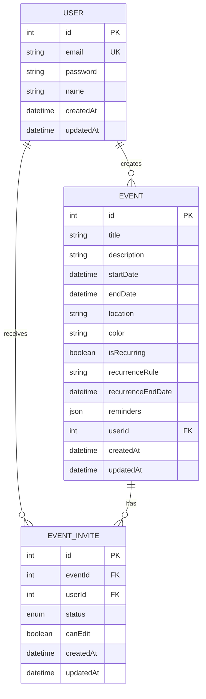
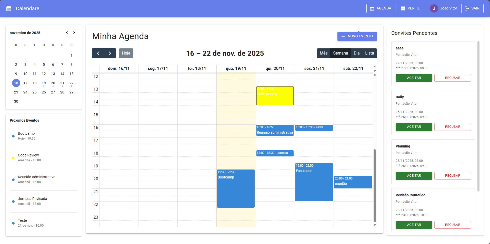

# Calendare

> Sistema de gerenciamento de agenda com eventos, convites e permissões

[](https://nodejs.org/)
[](https://reactjs.org/)
[](https://nestjs.com/)
[](https://www.postgresql.org/)
[](https://www.docker.com/)
[](https://www.typescriptlang.org/)
[](LICENSE)

## Sobre o Projeto

**Calendare** é uma aplicação web de gerenciamento de agenda que permite aos usuários criar, visualizar e compartilhar eventos.

## Tech Stack

### Backend
- **[NestJS](https://nestjs.com/)**
- **[Prisma](https://www.prisma.io/)** 
- **[PostgreSQL](https://www.postgresql.org/)** 

### Frontend
- **[React](https://reactjs.org/)** 
- **[Vite](https://vitejs.dev/)** 
- **[Material-UI](https://mui.com/)** 
- **[FullCalendar](https://fullcalendar.io/)** 
- **[React Hook Form](https://react-hook-form.com/)** 
- **[Axios](https://axios-http.com/)** 
- **[React Router](https://reactrouter.com/)** 

### Infraestrutura
- **[Docker](https://www.docker.com/)**

## Diagrama de Banco de Dados (DER)



## Pré-requisitos

- **[Node.js](https://nodejs.org/)** (versão 20 ou superior)
- **[Docker](https://www.docker.com/get-started)** e **[Docker Compose](https://docs.docker.com/compose/install/)**
- **[Git](https://git-scm.com/)**

## Instalação

### 1. Clone o repositório

```bash
git clone git@github.com:JoaoMichelS/Calendare.git
cd calendare
```

### 2. Configure as variáveis de ambiente

#### Backend
```bash
cd backend
cp .env.example .env
```

Edite o arquivo `.env` conforme necessário (valores padrão já funcionam com Docker).

#### Frontend
```bash
cd ../frontend
cp .env.example .env
```

### 3. Inicie os containers Docker

```bash
# Volte para a raiz do projeto
cd ..

# Inicie todos os serviços
docker-compose up -d
```

Aguarde alguns minutos para que todos os serviços sejam inicializados.

### 4. Execute as migrações do banco de dados

```bash
docker-compose exec backend npm run prisma:migrate
```

### 5. Acesse a aplicação

- **Frontend**: http://localhost:3000
- **Backend API**: http://localhost:3001
- **Prisma Studio**: http://localhost:5555

## Estrutura do Projeto

```
Calendare/
├── backend/                 # Backend NestJS
│   ├── prisma/             # Schema e migrações do Prisma
│   │   └── schema.prisma   # Definição do banco de dados
│   ├── src/
│   │   ├── auth/           # Módulo de autenticação
│   │   ├── events/         # Módulo de eventos
│   │   ├── users/          # Módulo de usuários
│   │   ├── prisma/         # Serviço do Prisma
│   │   └── main.ts         # Entry point
│   ├── Dockerfile          # Container do backend
│   └── package.json
│
├── frontend/               # Frontend React
│   ├── src/
│   │   ├── components/     # Componentes reutilizáveis
│   │   │   ├── Calendar/   # Componentes do calendário
│   │   │   ├── Navbar.tsx
│   │   │   └── ProtectedRoute.tsx
│   │   ├── contexts/       # Contextos React
│   │   ├── pages/          # Páginas da aplicação
│   │   ├── services/       # Serviços de API
│   │   ├── types/          # Tipos TypeScript
│   │   └── App.tsx
│   ├── Dockerfile          # Container do frontend
│   └── package.json
│
├── docs/                   # Documentação
│   └── POSTMAN.md         # Documentação da API
│
├── docker-compose.yml      # Orquestração de containers
└── README.md              # Este arquivo
```

## Comandos Úteis

### Docker

```bash
# Iniciar todos os serviços
docker-compose up -d

# Parar todos os serviços
docker-compose down

# Ver logs de um serviço específico
docker-compose logs -f [backend|frontend|postgres]

# Reconstruir os containers
docker-compose up -d --build

# Remover todos os containers e volumes
docker-compose down -v
```

## API Endpoints

A aplicação expõe uma API RESTful completa. Criei uma collection no postman com todos endpoints: [Collection Postman](https://feeltrack.postman.co/workspace/My-Workspace~8d2449fb-a403-4fd5-8069-4275d22eb21d/collection/31110505-173ab316-2c5f-46c3-89ec-19aca2c509e8?action=share&creator=31110505).

**Principais endpoints:**
- `POST /auth/register` - Registro de usuário
- `POST /auth/login` - Login
- `GET /events` - Listar eventos
- `POST /events` - Criar evento
- `POST /events/:id/invite` - Convidar usuários
- `GET /events/invites/pending` - Listar convites pendentes

## Screenshots


